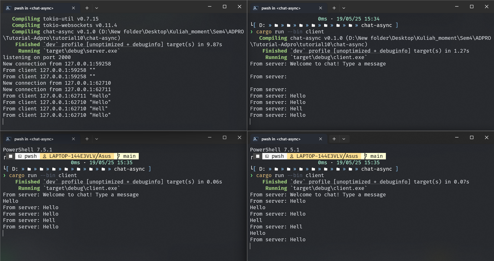

# Tutorial 10 - Broadcast

## 2.1. Original code of broadcast chat

Hasil diatas diperoleh oleh saya dengan menjalankan cargo run server pada satu terminal lalu membuka 3 terminal lain yang menjalankan cargo run client. Ketika menjalankan server, server akan listen kepada request yang masuk ke port 2000 dan setiap kali ada client yang connect server akan menampilkan pesan `New connection from...` pada console server. Ketika salah satu client mengetik pesan pada terminal misal "Hello", maka server akan print `From Client... "hello"` lalu pada tiap client lain yang terbuka akan ditampilkan `From server: Hello`. Server akan keep track connection dengan setiap clientnnya, kemudian jika ada pesan dari suatu client, maka semua client yang connected juga akan mendapatkan pesan tersebut.